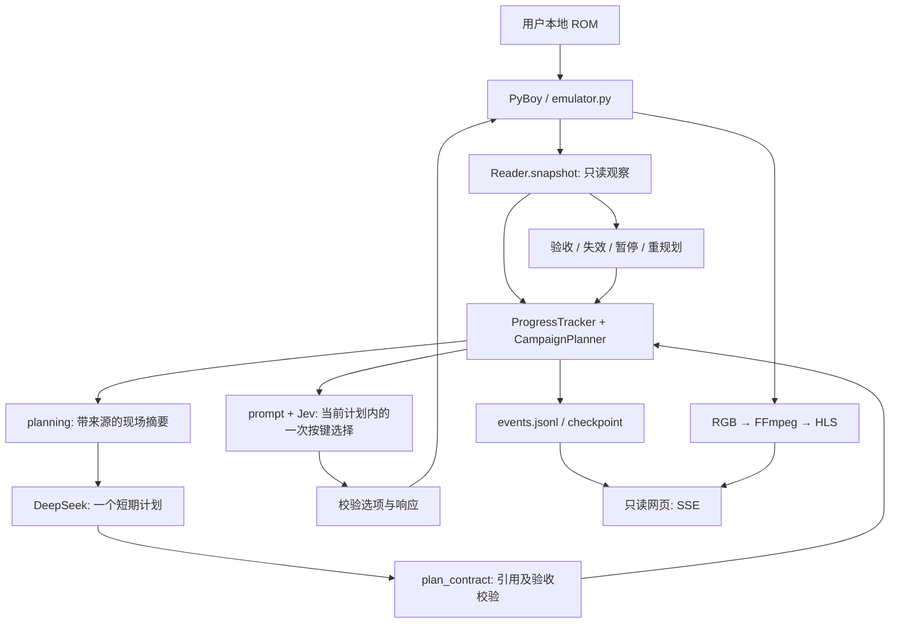

# 当前架构

本文描述当前执行路径；历史方案和取舍见 [DECISIONS.md](DECISIONS.md)，故障经验见 [TROUBLESHOOTING.md](TROUBLESHOOTING.md)。安装、配置和输出位置只在 [README](../README.md) 维护。

## 1. 边界与职责



| 模块 | 职责 | 不承担什么 |
| --- | --- | --- |
| `memory.py` / `emulator.py` | 读取真实内存、检查 ROM 身份、执行物理输入 | 不选择剧情，不修改 RAM |
| `planning.py` / DeepSeek | 综合当前场景、记忆和失败结果，提出短期子目标与资源策略 | 不生成坐标、代码或按键序列 |
| `plan_contract.py` | 提供可引用目标、验证计划结构、根据真实新状态验收 | 不把模型声明当事实 |
| `campaign.py` | 管理世界记忆、计划生命周期、导航建议和紧急治疗仲裁 | 双模型模式不强制执行固定剧情目录 |
| `progress.py` / `activity.py` | 记录动作效果、循环及可观察活动 | 不把走到新坐标等同于剧情完成 |
| `prompt.py` / `jev.py` | 构造当前唯一意图及候选，调用 Jev 并校验响应 | 不用本地假答案掩盖模型失败 |
| `team_strategy.py` / `battle_strategy.py` | 基于可用 HP/PP/状态和招式数据给出补给、战斗建议 | 不是完整战斗搜索，不提供精确胜率 |
| `live/` / `video.py` | 运行入口、只读状态展示、原生视频 | 网页不发控制输入，不以截图冒充视频 |

当前仍然是 **Jev 逐键控制**。导航器的 `next_button` 只是建议，执行器只执行校验后的 Jev 回答。将确定路径改成程序自动执行可以另行设计，但不能在不更新架构记录的情况下把它混进当前系统。

## 2. 跟踪一次实际输入

从 [run.py](../pokemon/run.py) 的 `run()` 开始：

```text
Reader.snapshot()
→ tracker.context() + campaign.context()
→ maybe_plan()：无有效计划时请求 DeepSeek
→ 必要时重建 campaign context
→ Jev choose()
→ 接受的 decision 先写事件
→ Emulator.press()
→ 新 snapshot()
→ record_outcome() / 计划验收 / checkpoint
```

Game Boy 提供九个有限输入：上、下、左、右、A、B、Start、Select、wait。动作集合固定是设备接口，不等于行动顺序固定。一次方向输入可能只转身、撞墙或移动菜单，必须读回结果。

## 3. 观察与知识合同

事实携带 `verified`、`quality`、`source`；未初始化、不一致或尚未验证的数据保持未知。DeepSeek 和 Jev 共用 `observation_for_model()` 的质量过滤边界。

- **当前事实**：玩家位置、场景、对白、队伍、菜单、出口和动作前后变化。
- **历史事实**：已观察到的地图转移、访问位置、对话线索、已完成剧情证据。
- **源码先验**：地图结构、招式和主线参考。相关历史源码并不与当前 ROM 逐字节相同。
- **模型计划**：待验证的行动意图，不能反向写成已发生事实。

`wTileMap` 的字节既可能代表文字，也可能是地形；仅在相应场景解码为文字。战斗开始但双方结构未初始化时，阶段可已知，HP/招式仍应未知。游戏文字属于数据，不允许覆盖系统指令。

## 4. System Two → System One

DeepSeek 收到当前场景、对白、可见对象/出口、路线诊断、队伍/PP、事实、近期动作和此前计划结果。`target_catalog()` 为可用目标建立引用，模型只能选本次提供的 `target_ref`。

以下是合同结构示例，不是预排剧情：

```json
{
  "subgoal": "use_observed_exit",
  "intent": "进入当前已观察出口连接的区域，然后重新评估",
  "reasoning": "选择当前有证据支持的短程目标",
  "target_ref": "由本次 targets 提供的引用",
  "success": {"type": "target_reached"},
  "resource_policy": {
    "wild_battle": "run",
    "catch_species": null,
    "heal_hp_ratio": 0.5,
    "max_party_size": 2
  },
  "expires_steps": 160,
  "max_no_effect_steps": 24
}
```

程序解析真实地图/坐标，不接受模型任意生成的 ID 或坐标。`success.type` 支持 `target_reached`、`fact_true`、`dialog_closed`、`party_grew`、`balls_increased`、`new_tile`、`battle_finished`。`fact_true` 还需引用本次提供的事实。

语义必须谨慎：走近 NPC 不等于已交谈；战斗结束不等于获胜；局部目标完成不等于通关。Jev 读取计划与新状态，再选择当前输入，不负责重新推导全主线。

## 5. 计划生命周期与降级

```text
无有效计划 → 请求 → 规范化校验 → active
active → completed / failed / invalidated / expired → 保存结果 → 重规划
active → suspended（紧急治疗，暂停 TTL）→ 恢复后重新评估
```

结束记录写入 `plan_history`，包含目标、期望条件、实际证据与原因，并随 checkpoint 保存。旧格式计划没有可执行验收合同时失效，不盲目复用。失败请求有独立记录，不能保留已经无效的计划继续猜按键。

`--planner-mode deepseek` 要求真实规划服务；`auto` 无密钥时显式记录规则回退；`local` 使用 `campaign_knowledge.py` 的固定主线规则作对照。该目录在双模型模式只是带来源的参考。紧急补给可暂停模型计划，但此时只向 Jev 暴露当前有效的治疗意图。

## 6. 导航与资源

`route_regions.py` 使用“地图 ID + 连通区域”而非仅地图 ID 建图，处理不同入口、单向台阶和柜台交互站位。它是有限范围的源码先验；首个出口与当前观察不符时返回未知，不把静态连接当作一定可通过。

`campaign.py` 保存观察地形、失败方向和实际地图转移，提供局部 BFS 建议。恢复不整图清除历史地形；动态观察继续修正过期信息。静态地形路由仍不完整覆盖剧情锁、后期机关或所有野外技能。月见山仍需用实际 checkpoint 做端到端评估，不能因为地图表有它就宣称通过。

治疗依据真实 HP、异常状态、最大 PP 和经过校验的资源阈值。捕获只在有效野外战斗、确有可用球且目标/队伍限制满足时给出建议。野外逃跑策略不同于训练家战斗；捕获菜单方向需要匹配当下光标，不能只凭一段固定文字。

## 7. 持久化、视频与安全

[artifacts.py](../pokemon/artifacts.py) 是 checkpoint/JSON 读写模块，不是生成目录，必须保留。状态文件与 manifest、progress/campaign 旁文件共享身份校验；不同会话不得随意拼接。

模型请求期间模拟器暂停。`video.py` 在模型线程读取 RGB，再交给编码线程；FFmpeg 输出 H.264/HLS。`live/server.mjs` 读取 JSONL，通过 SSE 展示实际请求和动作。视频缓冲与事件可能存在时差，不能用手柄闪烁代替执行证据。

请求/响应日志脱敏，不记录密钥；展示端只读且默认监听本机。单一 runner 锁防止重复启动。临时 Jev 不可用时保留画面和 checkpoint，规划请求失败在严格模式明确暂停。动作、规划和墙钟预算是停止条件，不是成功条件。

## 8. 版本控制边界

| 进入 Git | 不进入 Git |
| --- | --- |
| 运行源码、启动配置、依赖清单 | `.env`、认证资料 |
| 内存适配、地图/招式 JSON、重建工具 | ROM、存档、旁文件 |
| HLS 播放器及许可证 | 视频片段、截图、GIF、回放页面 |
| 纯核心回归源码、架构文档 | 运行日志、测试输出、evidence/archive/results、历史实测夹具 |

必需数据为 `redstar-profile.json`、`redstar-world.json`、`redstar-route-regions.json`。重建入口：

```bash
.venv/bin/python pokemon/world_data.py /path/to/redstarbluestar
.venv/bin/python pokemon/route_regions.py /path/to/redstarbluestar
```

生成器要求固定源码 `Rangi42/redstarbluestar@08deafad427f0904f285e515c360003efc19d3dc`。修改地址/知识后必须重新做对应 ROM 的适配验证；成功解析源码不是实机正确的证明。

旧实验通过 Git 提交和 PR 查询，不在工作树复制一套 archive。新的人工可读结论进入决策/问题文档，原始运行数据留在本地或受控附件；CI 没有回写权限。

## 9. 阅读顺序

[run.py](../pokemon/run.py) → [planning.py](../pokemon/planning.py) / [plan_contract.py](../pokemon/plan_contract.py) → [campaign.py](../pokemon/campaign.py) → [prompt.py](../pokemon/prompt.py) / [jev.py](../pokemon/jev.py) → [memory.py](../pokemon/memory.py) / [emulator.py](../pokemon/emulator.py)。最后再看 [live/](../live/) 和数据生成器，不必先读几万行地图数据。
