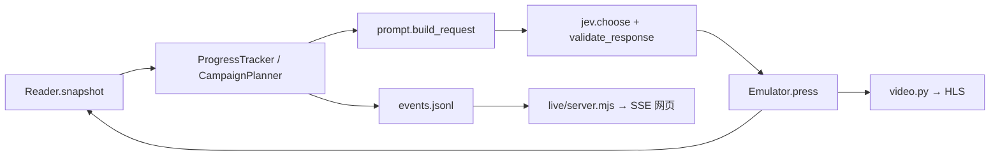

# 源码阅读路线：跟完一次真实按键

先读 `pokemon/run.py` 的 `run()`，找到 `for i in range(steps)`。环境启动、指标和异常处理可以稍后再看。每一步只有这一条控制链：



下面的概览省略日志参数，不是另一套实现：

```python
before = reader.snapshot()
before["progress"] = tracker.context(before)
before["campaign"] = campaign.context(before)
decision = decide(before, step)
button = record_decision(decision, step, screenshot_hash)
after = execute(button, verified_before, step)
outcome, activity = record_outcome(button, before, after)
```

## 1. 真实游戏怎样变成结构化状态

读 [memory.py](../pokemon/memory.py) 的 `Reader.snapshot()`，再按需要进入 `scene()`、`world()`、`party()` 和 `battle()`。

`Emulator.read()` 只读 RAM。地址来自固定版本的 Red Star 配置，构造模拟器时检查 ROM 哈希。字段带 `verified`、`quality` 和 `source`，未知值保持未知。例如：战斗已开始但双方数据尚未初始化时，可以确认战斗阶段，同时隐藏无效 HP/招式。

`memory.py` 的低层地址、字节布局和 ROM 签名可最后再读；它们是适配器边界，不是模型策略。

## 2. 程序提供哪些任务和记忆

读 [campaign.py](../pokemon/campaign.py) 的 `CampaignPlanner.context()`。顺序是：更新观察记忆 → 选择主线/补给目标 → 记录任务变化 → 计算目标与导航建议。

| 模块 | 只负责什么 |
| --- | --- |
| [campaign_knowledge.py](../pokemon/campaign_knowledge.py) | 预先编写的任务、前置条件和完成谓词 |
| [team_strategy.py](../pokemon/team_strategy.py) | 低 HP、异常状态或 PP 不足时的持续补给目标 |
| [route_regions.py](../pokemon/route_regions.py) | 地图区域/出口连通，处理单向台阶和柜台交互站位 |
| [progress.py](../pokemon/progress.py) | 已访问坐标、重复交互、最近动作与三组前后状态 |
| [battle_strategy.py](../pokemon/battle_strategy.py) | 已验证数据支持的条件伤害比较和菜单建议 |

任务由已验证事实完成；源码地图和故事知识仅提供带来源的先验。路线建议和战斗建议不直接发送任何按键。

## 3. JEV 实际收到什么

读 [prompt.py](../pokemon/prompt.py) 的 `build_request()`：

1. `observation_for_model()` 保留当前可用字段，明确未知和验证边界。
2. `compact_campaign()` 保留当前任务所需内容。
3. `recent_actions()` 使用已有 tracker 记忆，避免主循环另存一份历史。
4. `focus_and_choices()` 生成即时焦点及全部九个候选。
5. 组装 `{model, state, questions}`，固定控制指令来自 [prompts/button.txt](../pokemon/prompts/button.txt)。

### `current_focus` 从哪里来

它是本地生成的模型输入，按以下顺序覆盖，后者优先：

- 当前主线/补给任务的 `intent`；没有任务时退回场景/循环提示。
- 进入战斗后，优先处理当前战斗界面。
- 完整训练师开场对白出现后，提示按 A 确认。
- 有可用战斗菜单建议时，填入推荐招式、槽位和下一按键。

走路时焦点可以保持“挑战小刚”；每一步的路线更新另在 `campaign.navigation`。`campaign.recovery` 提供恢复诊断，固定指令要求模型重新判断。最终按键仍来自 JEV 的回答。

## 4. 模型答案怎样变成一次输入

读 [jev.py](../pokemon/jev.py) 的 `choose()` 和 `validate_response()`。这里处理 HTTP、脱敏、临时故障重试，以及选项/概率格式校验；请求构造已与网络代码分开。

校验通过后，主循环取 `answer.choice`，调用 [emulator.py](../pokemon/emulator.py) 的 `press()`：先松开旧按键 → 按下所选键 → 推进帧 → 松开 → 再观察。完整物理输入集合只定义在 [controls.py](../pokemon/controls.py)。不执行模型生成的代码或任意 RAM 写入。

## 5. 怎样判断推进、恢复和停止

`record_outcome()` 更新记忆，并同时区分新剧情证据和可观察状态变化。[activity.py](../pokemon/activity.py) 的 `StallMonitor` 不会仅因沿旧路线行走就暂停；箭头闪烁和帧数增长也不会伪装成推进。真实无变化或重复循环先经过有界重新观察/规划，再保存暂停。

[artifacts.py](../pokemon/artifacts.py) 负责原子写 JSON、验证 state/ROM 哈希、保存与恢复 progress/campaign sidecar。临时 JEV 断连时，模拟器保持当前状态和视频，等待恢复；不会猜一个按键继续。

## 6. 网页和视频为什么分开

[live/pokemon.mjs](../live/pokemon.mjs) 是启动入口：参数 → 存档选择 → 独占锁 → Python 子进程。`--live` 额外启动网页；网页始终只读。

[live/server.mjs](../live/server.mjs) 按顺序读 Pokémon 的 JSONL，提供历史 API/SSE 与 HLS 资源。前端职责：

| 文件 | 阅读重点 |
| --- | --- |
| [app.js](../live/public/app.js) | 会话选择、SSE、时间线和视图协调 |
| [request-inspector.js](../live/public/request-inspector.js) | 直接展示实际记录的请求、字段及提示词 |
| [campaign-panel.js](../live/public/campaign-panel.js) | 当前任务、证据、路径与地图记忆 |
| [video-player.js](../live/public/video-player.js) | 视频连接、重试和播放状态 |
| [controller-view.js](../live/public/controller-view.js) | 视频下方的只读手柄，回显真实执行按键 |
| [video.py](../pokemon/video.py) | 模拟器 RGB 帧 → FFmpeg → H.264/HLS |

视频不是截图轮询，网页不会操纵模拟器。模型请求等待期间，游戏停在当前真实状态，视频连接继续。手柄只在新的真实 `executing` 事件出现时短暂高亮；决策候选、历史记录和断线补发不会伪装成新按压。按键事件与缓冲后的视频可能存在时间差。

## 第一遍可以跳过的内容

`redstar-world.json`、`redstar-route-regions.json` 是生成数据；`tools/` 是离线生成器。`evidence/`、`results/`、`archive/` 是验证和历史材料。它们保留可追溯性，但不需要逐行读完才能理解 agent。

整理使用 `uvx ruff==0.12.12 format`，规则在 `pyproject.toml`。重构通过请求逐字节比较、真实存档只读快照比较和现有回归验证；没有用重构来改变游戏策略。
