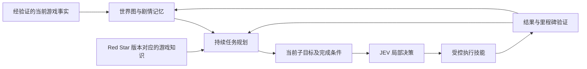

# 以通关为目标的 Pokémon agent：一手实现对照

核对日期：2026-09-22。目标定义为完成 Red Star 主线：击败联盟冠军并进入名人堂。局部探索、移动、获得新坐标、达到步数预算都不是终点。

本次代码已修改默认 `--goal`，并在 JEV 指令中明确总体目标优先于局部 `current_focus`。下面的任务规划、知识检索、里程碑检测和语义技能是**待实现的改造设计**；修改目标声明不等于这些能力已经存在。游戏保持停止，既有请求日志保留原文。

## 哪些资料真的涉及通关

| 一手来源 | 能证实什么 | 不能混为一谈的地方 |
| --- | --- | --- |
| [Google Gemini 2.5 技术报告 §4.1](https://storage.googleapis.com/deepmind-media/gemini/gemini_v2_5_report.pdf#page=16) | 报告记载 GPP 第一轮 813 小时进入名人堂；第二轮固定 harness、全自主运行 406.5 小时通关。 | 第一轮是边运行边开发；本次没有独立重放其通关结果，数字不能直接估算我们的 Red Star 用时。 |
| [GPP 架构说明 Appendix 8.2](https://storage.googleapis.com/deepmind-media/gemini/gemini_v2_5_report.pdf#page=66) | 持续主/次/第三目标；RAM 派生的地形和 warp 地图；导航/推石头工具；25 回合复盘、100/1000 回合分层压缩。 | 是具备推理和工具能力的系统，不是只看三个状态后选择按钮。报告也记录长历史引发重复行为的现象。 |
| [GPP 公开追踪仓库](https://github.com/waylaidwanderer/gemini-plays-pokemon-public/blob/db59da37fc563958b4210ec4a46b6db2fc8c1146/README.md) | 可查看各分支的笔记、地图标记、agent/tool 定义与版本演进。 | 不是完整原始 harness 源码包。 |
| [Clad FireRed 目标提示词](https://github.com/Clad3815/gpt-play-pokemon-firered/blob/9619b101d607ee79b68e1274174ac3b6eeb6ff06/server/prompts/game.txt) | 通关目标、持续任务、游戏规则、战斗与补给知识直接进入控制系统。 | 这是 FireRed 结构化状态版本；不能将其规则、RAM 地址或成绩直接算到 Red Star。 |
| [Claude Starter](https://github.com/davidhershey/ClaudePlaysPokemonStarter/blob/2ab0551016aba9af3ffa6fbb6e747d1ec33c08f8/agent/simple_agent.py) | 总目标为击败四天王，历史摘要保留里程碑、目标、队伍和策略。 | 仓库是 minimal starter，不等于作者完整版直播，也不是该版本已通关的证明。 |
| [PokéAgent 指令](https://github.com/sethkarten/continual-harness/blob/bbab97ad73e460b7cd7c08527d10ced30cc03fbe/agents/prompts/pokeagent-directives/POKEAGENT.md) | 任务规划、攻略检索、完成验证、记忆处理、卡住复盘和战斗分工。 | [挑战论文](https://arxiv.org/html/2603.15563v1)中的那次 speedrun 比较只到 Emerald 第一馆；其 100% 不能读成全游戏通关。 |

GPP 后续的[作者论文](https://arxiv.org/html/2605.09998v1#S4.SS2)还区分了人工设计/迭代的早期 harness 与自动 Refiner，并记录生成工具、修改专家策略和长期循环失败。自动工具或多 agent 本身也不是成功保证。

## 他们提供给模型的东西，比我们多在哪里

Clad 的[输入构建代码](https://github.com/Clad3815/gpt-play-pokemon-firered/blob/9619b101d607ee79b68e1274174ac3b6eeb6ff06/server/src/ai/promptBuilder.js)同时提供位置、对白、队伍/PP/道具、战斗、目标、记忆、地图标记和探索地图；其[工具](https://github.com/Clad3815/gpt-play-pokemon-firered/blob/9619b101d607ee79b68e1274174ac3b6eeb6ff06/server/src/ai/tools.js)允许维护目标/记忆，并针对已知地图做导航。任务是持续的意图和完成条件，不是“再走三格”。

当前本仓库只能可靠提供局部场景和物理输入效果。最近三次转移适合判断对话开关与移动，但几步后会遗忘地图间关系；内部访问计数也没有形成可供任务规划使用的世界图。最新失败会话第 31 步从 38 到 37，第 47 步又返回 38；新坐标计数甚至可以奖励这种返回。因此通关层必须另行存在。

## 应采用的控制闭环（尚未实现）



1. **持续任务记录**：保留总目标、当前子目标、前置条件、依据、预期效果和验收条件。换地图、关闭对话或压缩历史不能把目标重新变成“探索邻格”。
2. **世界图**：保存真实观察到的地图转换及入口/落点/触发动作；区分已确认、推测和已否定的连接。地图名、NPC、门与可交互物体需要版本匹配的来源或实机证据。
3. **相关知识检索**：只发送当前任务所需的规则、关键物品、剧情依赖和战斗知识；资料携带游戏版本和来源。旧笔记遇到 RAM/实际结果反证时应更新。
4. **阶段与战斗规划**：队伍、HP/PP、背包、徽章和剧情事件必须先完成当前 ROM 的适配验证，才能依据它们计划补给、战斗或推进剧情。
5. **执行与纠错**：JEV 可继续负责局部动作选择；路径或技能若由程序生成，应明确标记为程序能力。失败后重新观察与规划，不能无限重试同一条路线。
6. **通关验收**：依据当前 ROM 验证过的冠军/名人堂证据判断结束。局部坐标变化、八枚徽章本身、模型宣称和步数预算不能替代终局证据。

## 建议输入合同（设计示例，不是当前实际请求）

```json
{
  "campaign_goal": "Complete the main story and enter the Hall of Fame",
  "active_objective": {
    "id": null,
    "intent": null,
    "prerequisites": [],
    "completion_conditions": [],
    "evidence_refs": [],
    "status": "needs_planning"
  },
  "verified_progress": {},
  "relevant_game_knowledge": [],
  "known_map_connections": [],
  "interaction_clues": [],
  "failed_hypotheses": [],
  "current_observation": {},
  "recent_transitions": []
}
```

未知字段保留未知，不用原版 Red/FireRed 攻略假装当前改版已经验证。观测到的连接应长期保存；比如 `38:(7,2) + up -> 37:(7,1)` 是动作前后位置证据，可以记录为已观察转换，但还不能仅凭这条日志自动命名所有门和 NPC。

## 模型分工与实现边界

参考项目的大型模型承担持续规划、反思和工具调用。对本项目可有两条路径：

- 高层规划 agent 管理目标、知识与记忆，JEV 执行密集的结构化局部决策。
- 保持 JEV-only，但由程序提供经过验证的任务图、候选子目标和前置条件，再让 JEV 做分层 Choice。此时任务图和知识的贡献必须明确披露，不能说是逐键模型自动产生了整套规划。

本次没有接入其他付费模型、没有启动游戏，也没有用手写路线代替 JEV。首个实现阶段应是“任务记录 + 已观察地图连接 + 可信完成条件”，然后验证从初期阶段持续推进多个里程碑；完整主线需要后续逐项补齐战斗与事件适配。

## Red Star 终点线索的证据边界

固定历史源码的[名人堂脚本](https://github.com/Rangi42/redstarbluestar/blob/08deafad427f0904f285e515c360003efc19d3dc/scripts/halloffameroom.asm)和[对白](https://github.com/Rangi42/redstarbluestar/blob/08deafad427f0904f285e515c360003efc19d3dc/text/maps/hall_of_fame.asm)说明冠军与名人堂流程存在。脚本保存游戏并重置部分四天王事件，提示终局检测不能简单依赖某个临时战斗脚本值。这只是定位适配工作的源码线索；历史重编译与当前 ROM 哈希不同，尚不能作为已经验证的自动通关检测器。
