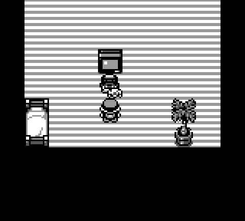

# Pokémon 本次运行结果

**流程执行结束不等于模型取得进展，更不等于通关。**

来源：https://github.com/atrl/minecraft-jev-readable/actions/runs/35681979746

| 检查 | 结果 |
|---|---|
| 停止原因 | `budget_reached` |
| Jev 调用 / 已执行动作 | 12 / 12 |
| 坐标变化 / 不同位置数 | 0 / 1 |
| 开始位置 | {&#x27;map_id&#x27;: 38, &#x27;x&#x27;: 3, &#x27;y&#x27;: 6} |
| 结束位置 | {&#x27;map_id&#x27;: 38, &#x27;x&#x27;: 3, &#x27;y&#x27;: 6} |
| 按键次数 | {&#x27;wait&#x27;: 3, &#x27;a&#x27;: 9} |
| 任务完成 | 未独立验证 |

> 本次坐标未改变；可能在对话、菜单或原地循环，不代表任务完成。

## 截图回放

每步截图按固定间隔播放，**不是实时录像**。

## 交互查看

从 Actions 页面底部下载 **Artifacts**，解压并双击 `index.html`。
可逐步查看截图、按键、概率、前后坐标和完整请求；文件离线可用，不需要启动服务。

GitHub 中的 HTML 文件默认显示源码，不是预览页面；在 GitHub 上直接看本 README 的 GIF。

## 动作记录

| 步骤 | 按键 | 执行前 | 执行后 |
|---|---|---|---|
| 1 | wait | {&#x27;map_id&#x27;: 38, &#x27;x&#x27;: 3, &#x27;y&#x27;: 6} | {&#x27;map_id&#x27;: 38, &#x27;x&#x27;: 3, &#x27;y&#x27;: 6} |
| 2 | wait | {&#x27;map_id&#x27;: 38, &#x27;x&#x27;: 3, &#x27;y&#x27;: 6} | {&#x27;map_id&#x27;: 38, &#x27;x&#x27;: 3, &#x27;y&#x27;: 6} |
| 3 | wait | {&#x27;map_id&#x27;: 38, &#x27;x&#x27;: 3, &#x27;y&#x27;: 6} | {&#x27;map_id&#x27;: 38, &#x27;x&#x27;: 3, &#x27;y&#x27;: 6} |
| 4 | a | {&#x27;map_id&#x27;: 38, &#x27;x&#x27;: 3, &#x27;y&#x27;: 6} | {&#x27;map_id&#x27;: 38, &#x27;x&#x27;: 3, &#x27;y&#x27;: 6} |
| 5 | a | {&#x27;map_id&#x27;: 38, &#x27;x&#x27;: 3, &#x27;y&#x27;: 6} | {&#x27;map_id&#x27;: 38, &#x27;x&#x27;: 3, &#x27;y&#x27;: 6} |
| 6 | a | {&#x27;map_id&#x27;: 38, &#x27;x&#x27;: 3, &#x27;y&#x27;: 6} | {&#x27;map_id&#x27;: 38, &#x27;x&#x27;: 3, &#x27;y&#x27;: 6} |
| 7 | a | {&#x27;map_id&#x27;: 38, &#x27;x&#x27;: 3, &#x27;y&#x27;: 6} | {&#x27;map_id&#x27;: 38, &#x27;x&#x27;: 3, &#x27;y&#x27;: 6} |
| 8 | a | {&#x27;map_id&#x27;: 38, &#x27;x&#x27;: 3, &#x27;y&#x27;: 6} | {&#x27;map_id&#x27;: 38, &#x27;x&#x27;: 3, &#x27;y&#x27;: 6} |
| 9 | a | {&#x27;map_id&#x27;: 38, &#x27;x&#x27;: 3, &#x27;y&#x27;: 6} | {&#x27;map_id&#x27;: 38, &#x27;x&#x27;: 3, &#x27;y&#x27;: 6} |
| 10 | a | {&#x27;map_id&#x27;: 38, &#x27;x&#x27;: 3, &#x27;y&#x27;: 6} | {&#x27;map_id&#x27;: 38, &#x27;x&#x27;: 3, &#x27;y&#x27;: 6} |
| 11 | a | {&#x27;map_id&#x27;: 38, &#x27;x&#x27;: 3, &#x27;y&#x27;: 6} | {&#x27;map_id&#x27;: 38, &#x27;x&#x27;: 3, &#x27;y&#x27;: 6} |
| 12 | a | {&#x27;map_id&#x27;: 38, &#x27;x&#x27;: 3, &#x27;y&#x27;: 6} | {&#x27;map_id&#x27;: 38, &#x27;x&#x27;: 3, &#x27;y&#x27;: 6} |
